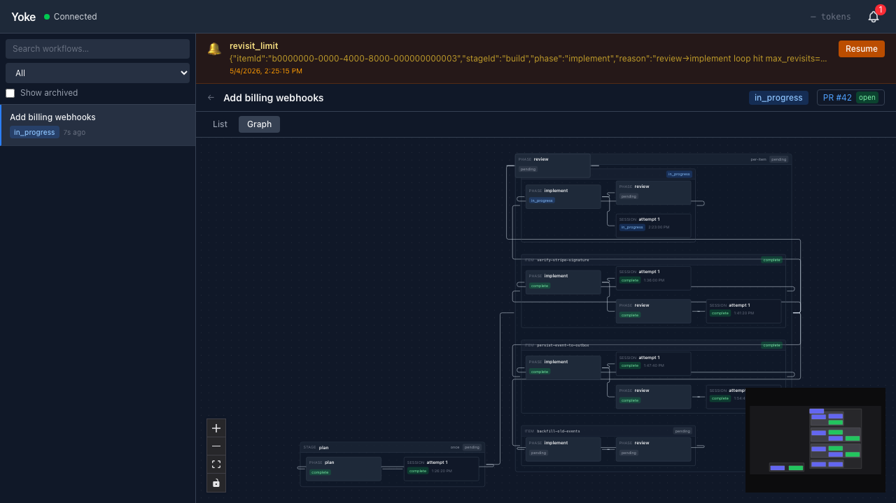
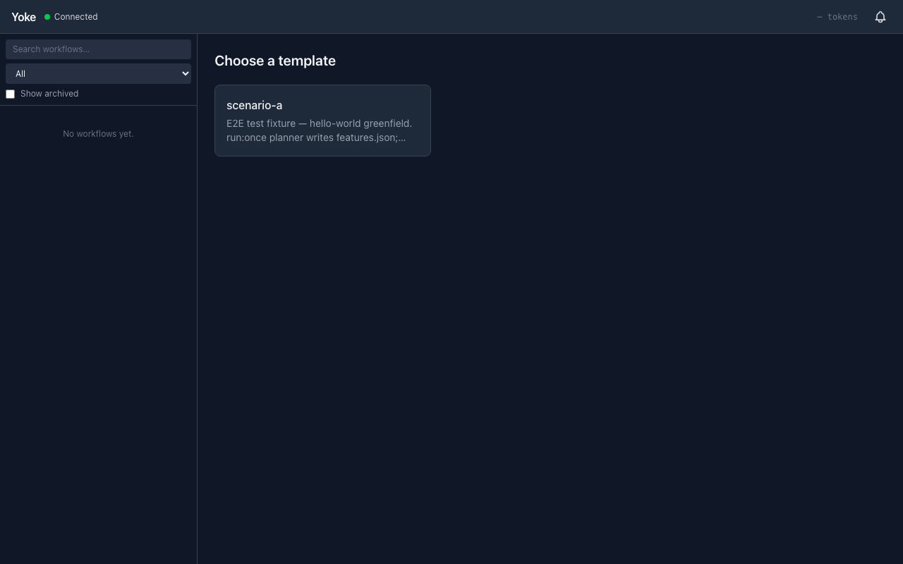
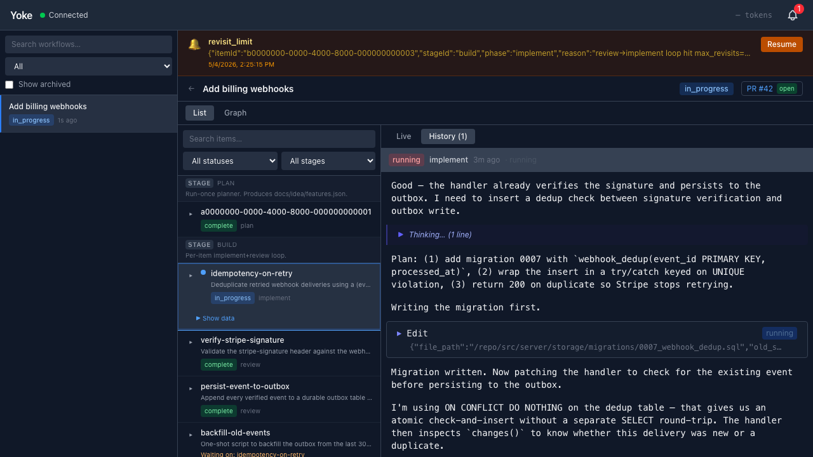
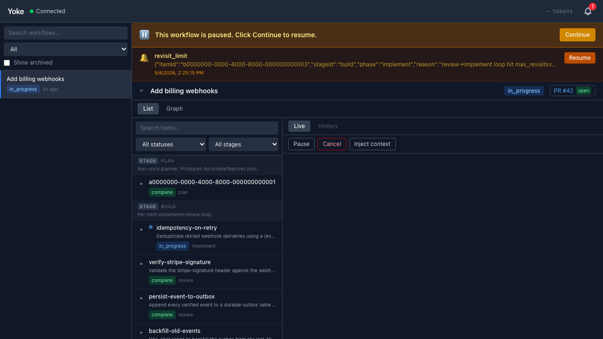
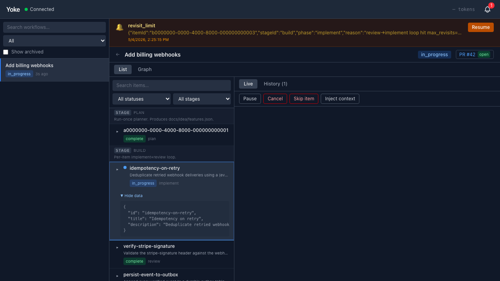
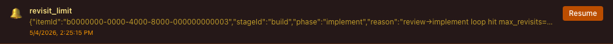
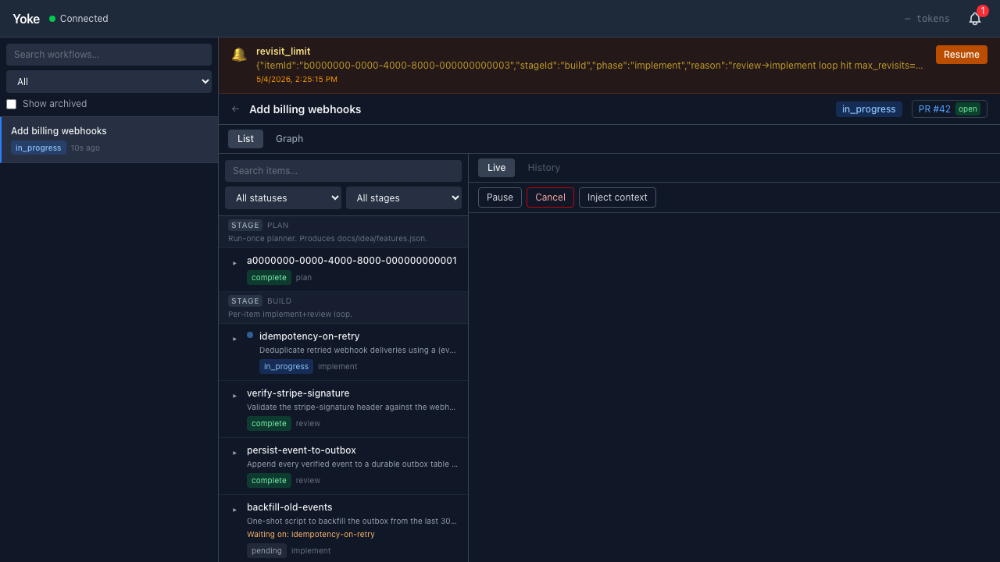

# Yoke

**The autopilot for Claude Code.** Yoke runs Claude Code (or any agent CLI you point
it at) on a loop: planning, building, reviewing, retrying, then opening the PR — all
inside isolated git worktrees, all watchable from a local dashboard, all driven by a
small YAML file you own.

Think of it as `make` for autonomous coding sessions. You declare the pipeline, Yoke
runs it overnight.



*A live workflow as Yoke renders it: a `plan` stage that emits features, then a
`build` stage running implement+review per feature in parallel worktrees. Green =
complete, indigo = phase, the badge in the top right tracks an open PR.*

---

## The dashboard is the product

Yoke is a server + a browser dashboard. You start it once with `yoke start`, and
everything else happens at `http://127.0.0.1:7777`. Pick a template, click Run,
watch agents work in real time, click into any item to see its session log, hit
Resume when something needs your attention.

### Pick a template


Every `.yoke/templates/*.yml` file shows up as a card. Click one, name the run,
go.

### Watch agents work in real time


Stream-json output from each running session — assistant text, tool calls,
thinking blocks, usage — all virtualized so a 10,000-line transcript stays
smooth. The same view backs `per-item` stages: every feature gets its own
streaming pane.

### See the whole pipeline as a graph


Stages, items, phases, sessions, and pre/post commands as a hierarchical graph.
Click any node for a summary in the right pane. Useful for catching `depends_on`
mistakes before you launch.

### Track per-item progress on the feature board


When a stage runs `per-item`, every item gets a card with its current phase,
status, and inline session timeline. The "Workflow paused" banner shows when
you've paused execution — Yoke remembers exactly where it stopped and resumes
on click.

### Drill into one item


Open any item to see its data payload, every session attempt, and the full
streaming output. Retries appear inline — you can see the failure, the action
the harness took (`goto implement`), and the next attempt right under it.

### Get pulled in only when needed


When a phase needs you — bootstrap failure, retry-limit hit, manual approval —
Yoke surfaces a banner with the reason. Click Resume and it picks up from
exactly where it left off.

### Auto-PR when the workflow finishes


Configured with a GitHub remote, Yoke pushes the worktree branch and opens the
PR for you when the run completes. The header tracks PR state live.

---

## Quick start (30 seconds)

```sh
npm install -g @jdforsythe/yoke
cd ~/code/my-project        # any git repo
yoke setup                  # answer five questions
yoke start                  # opens http://127.0.0.1:7777
```

> **Note:** the npm release is in flight — track [issue #1](https://github.com/jdforsythe/yoke/issues/1)
> for v0.1.0. Today you can clone the repo and run `pnpm install && pnpm run build && bin/yoke`,
> or grab a tarball with `npm pack`. See [docs/install.md](docs/install.md) for the
> current options.

For a guided five-minute walkthrough, see **[docs/getting-started.md](docs/getting-started.md)**.


---

## Why Yoke

**It's a harness, not an IDE.** Yoke doesn't replace Claude Code or write any code
itself. It launches the agent, captures its stream-json output, persists every event
to SQLite, enforces the phase transitions you defined, and resumes cleanly after a
crash. You keep the prompt, the model, and the toolchain you already use.

**It's for long, multi-step jobs.** Anything that takes more than one session — a
plan-implement-review loop on twelve features, a codemod across a monorepo, a
chapter-by-chapter draft — benefits from a harness that remembers what's done, retries
the failures, and pauses on the gnarly parts.

**It's local-only, single-user, by design.** Binds to `127.0.0.1`, no auth, no
multi-tenant story, no telemetry. Your code stays on your laptop. The dashboard is a
private control panel, not a SaaS.

---

## A minimal template

A template lives at `.yoke/templates/<name>.yml` and describes one reusable pipeline
shape. Here is a single-phase one — implement once, run a test gate, ship.

```yaml
version: "1"

template:
  name: one-shot                    # appears in the dashboard picker
  description: "Build it in one session, then run the test suite"

pipeline:
  stages:
    - id: build
      run: once                     # one execution per workflow (vs per-item)
      phases: [implement]

phases:
  implement:
    command: claude
    args: ["-p", "--output-format", "stream-json", "--verbose",
           "--dangerously-skip-permissions"]
    prompt_template: prompts/implement.md
    post:
      - name: run-tests
        run: ["pnpm", "test"]
        actions:
          "0": continue                          # 0 = pass: move on
          "*":                                   # anything else: retry once
            retry: { mode: fresh_with_failure_summary, max: 1 }
```

That's the whole thing. The full reference lives in
[docs/configuration.md](docs/configuration.md).

---

## What you can do with this

### Build a small app in one session
**[Recipe → one-shot.md](docs/recipes/one-shot.md)** — single-phase pipeline: one
prompt, one Claude session, one set of files written. The bundled
`yoke init --template one-shot` scaffolds it for you.

### Build a multi-feature project with a review loop
**[Recipe → plan-build-review.md](docs/recipes/plan-build-review.md)** — planner emits
`features.json`, each feature gets implement+review, FAIL routes back to implement.

### Coordinate parallel features with dependencies
**[Recipe → parallel-features-with-deps.md](docs/recipes/parallel-features-with-deps.md)**
— feature C waits on A and B; A and B run in their own worktrees in parallel.

### Run a marketing pipeline
**[Recipe → marketing-pipeline.md](docs/recipes/marketing-pipeline.md)** — five ad
variants per persona with a brand-voice reviewer. No code, just prompts.

### Draft a novel chapter by chapter
**[Recipe → creative-writing.md](docs/recipes/creative-writing.md)** — outline, draft,
editorial pass, continuity check, repeat.

### Stand up an adversarial multi-reviewer
**[Recipe → multi-reviewer.md](docs/recipes/multi-reviewer.md)** — implement, then
three reviewer subagents run in parallel via the Task tool, then a synthesizer rolls
the verdict back to implement on FAIL.

---

## CLI reference (short version)

| Command | What it does |
|---|---|
| `yoke init` | Scaffold a stub `.yoke/templates/default.yml` |
| `yoke setup` | Guided setup: write a complete template + prompts via Claude |
| `yoke start` | Start the engine and dashboard at `http://127.0.0.1:7777` |
| `yoke status` | Poll workflow state from the running server |
| `yoke cancel <id>` | Cancel a running workflow |
| `yoke ack <id>` | Resume an awaiting-user workflow |
| `yoke doctor` | Validate your templates and check prerequisites |

`yoke setup` opens an interactive Claude Code session in your current directory
with the `skills/yoke-setup.md` skill appended as a system-prompt extension, so the
model knows the current Yoke conventions and can produce a working template + prompts
+ scripts for you in one sitting.

Full flag listings are in [docs/install.md](docs/install.md) and the per-command
`--help`.

---

## Where to go next

- **[Five-minute first workflow](docs/getting-started.md)**
- **[Install guide](docs/install.md)** — npm, manual, dev, requirements
- **[Configuration reference](docs/configuration.md)** — every key in the template
- **[Templates guide](docs/templates.md)** — anatomy and pipeline shapes
- **[Prompts guide](docs/prompts.md)** — variables and writing style
- **[Dashboard tour](docs/dashboard.md)** — every panel, every keyboard shortcut
- **[Recipe gallery](docs/recipes/)** — copy-pasteable workflows
- **[Troubleshooting](docs/troubleshooting.md)** and **[FAQ](docs/faq.md)**

---

## License

MIT. See [LICENSE](LICENSE).

## Contributing

Bug reports and PRs are welcome. The repo is small and the architecture is documented;
start with [CONTRIBUTING.md](CONTRIBUTING.md). Security issues: see
[SECURITY.md](SECURITY.md) (single-user, local-only threat model).
